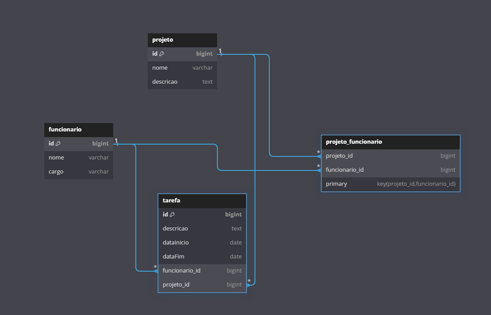

# ProjetoLPOOE1_FranciscoJunior

Avaliação da disciplina de LPOO - Linguagem de Programação Orientada a Objetos

## Modelagem

A modelagem do sistema incluiu as seguintes entidades e seus relacionamentos:

